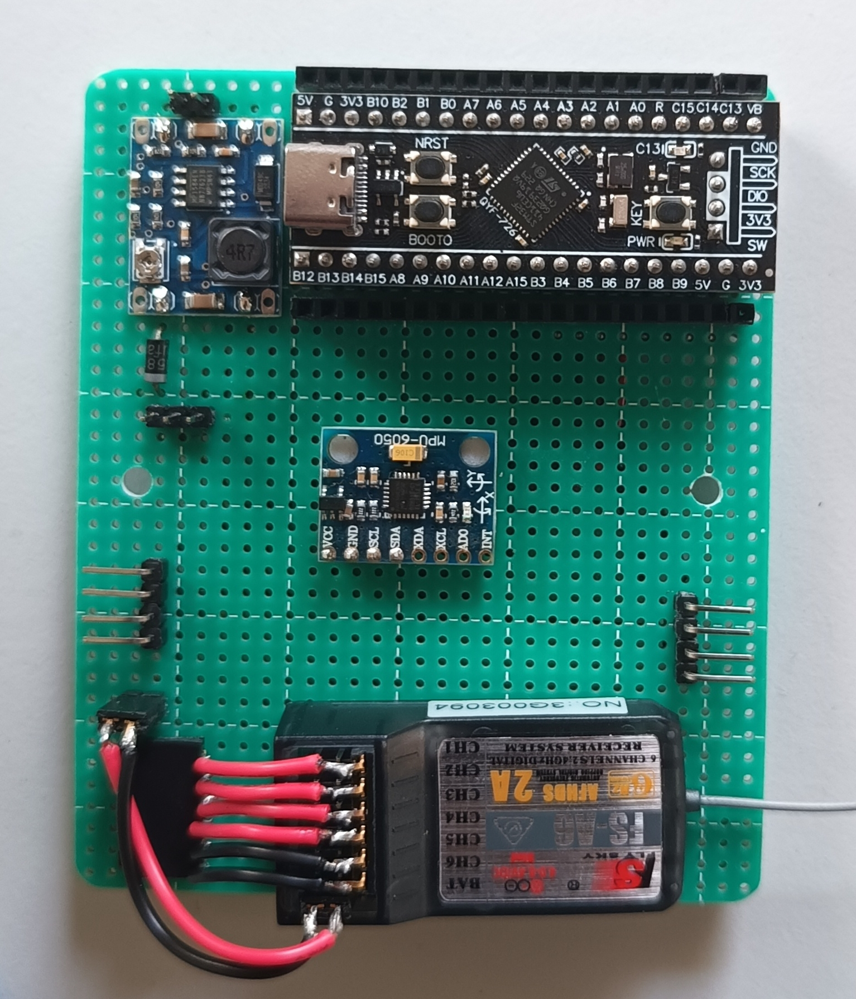
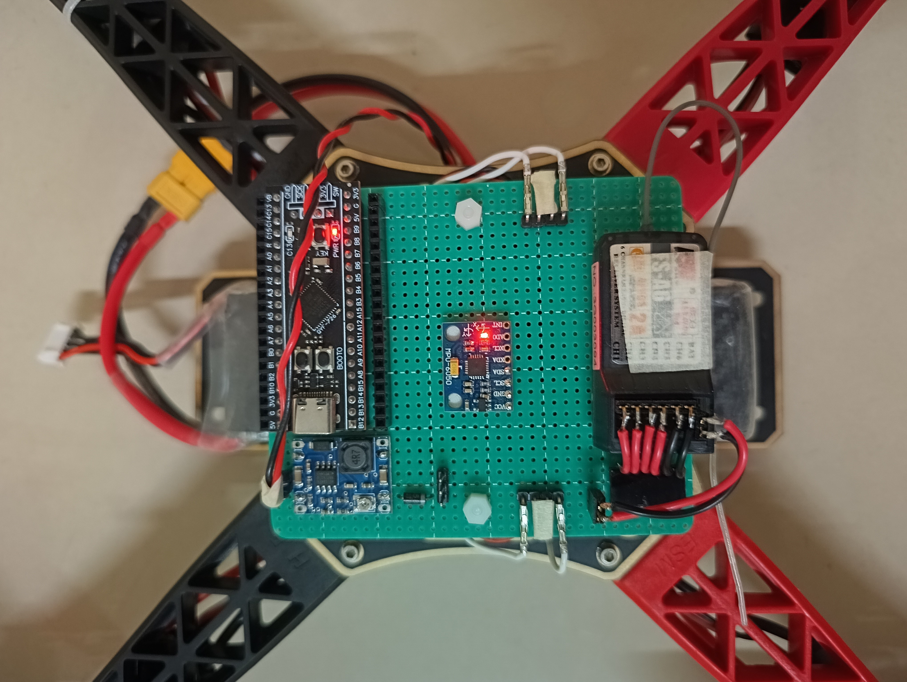
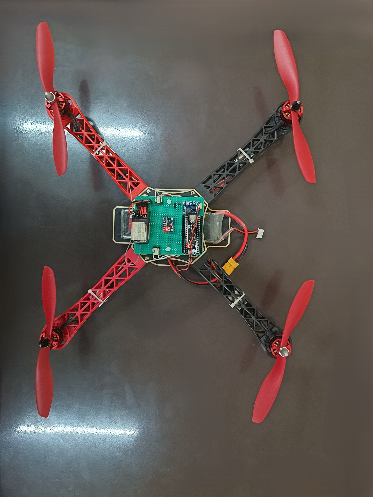
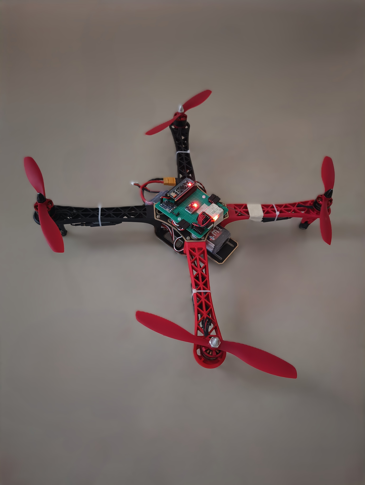
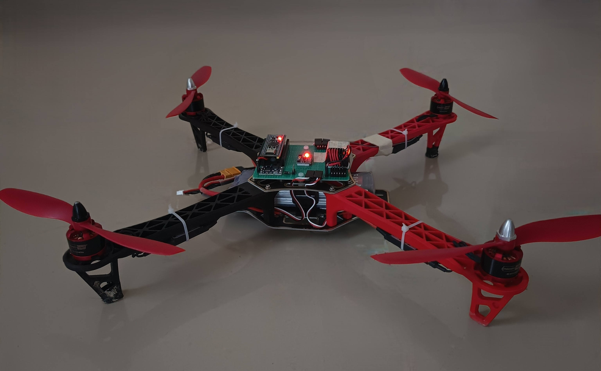

# A flight controller using STM32F411CEU6 blackpill board and MPU6050 imu.

* This is in the development phase, and there is many problem in it.
* I am still working on it to fix those crucial problem.
* So, don't try to use it, this may be very dangerous

